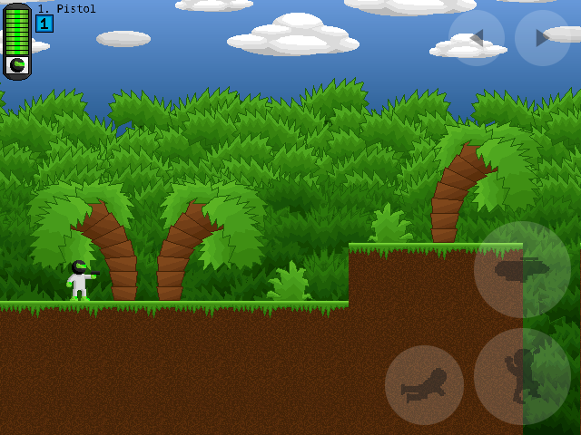
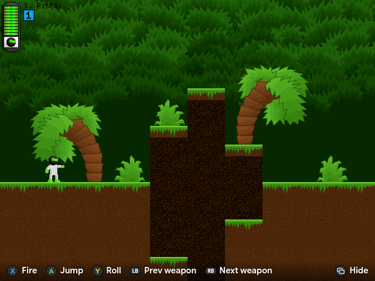
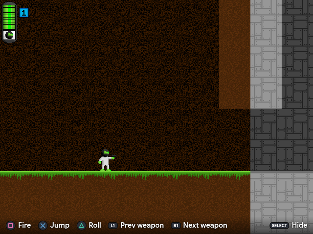
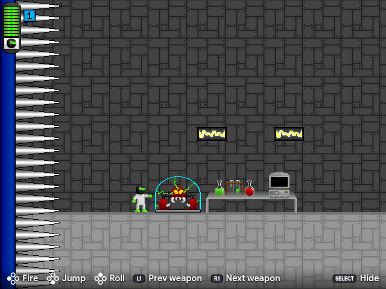

# Gunner 3

A port of **Gunner 3** by KNPMaster (Gary Gasko) to the browser.

The game is not rewritten. Its assets and event tables are extracted from the original
Multimedia Fusion 1.5 executable, and a runtime interprets them as they stand, so the port is
that runtime plus the game's own data. The aim is to play exactly like the original, bugs
included, and to add nothing to it except better ways of reaching it: a phone, a gamepad, a
screen of any size.

The game itself is not in this repository. It is freeware, and still where it has always been:
on its author's site, [thegamespage.com](https://www.thegamespage.com/), and on the
[Internet Archive](https://archive.org/details/gunner3). A build fetches a copy, or takes one
you already have.

The file formats were worked out by reverse engineering, with
[Matt-Esch/anaconda](https://github.com/Matt-Esch/anaconda) and
[NebulaFD](https://github.com/AITYunivers/NebulaFD) as references.

  
   
  Built from the latest commit on <code>main</code>.

| Main menu | First level |
|---|---|
|  |  |

## Accessibility

Gunner 3 was written for a keyboard and a mouse on a Windows desktop. Everything here is a way
of reaching it from something else. What the game is handed is always the keys and the mouse it
already reads, so nothing in it knows the difference.

| Touch | Gamepad, Xbox |
|---|---|
|  |  |
| **Gamepad, PlayStation** | **Gamepad, anything else** |
|  |  |

A cogwheel in the corner holds the rest: how the game is fitted to the screen, fullscreen,
smoothing, and volume. What you choose is remembered.

## How it works

The game's 7722 events are not translated into code. They are interpreted at runtime, which is
practical because the whole game uses only 34 condition opcodes and 43 action opcodes, and 90%
of its expressions are a bare constant.

Fusion's per-tick model is reproduced directly: every event is visited in order, its conditions
narrow a per-event instance selection, and its actions apply to that selection. An unimplemented
condition fails its event rather than letting it fire, so gaps show up as missing behaviour
rather than wrong behaviour. Collision is per pixel, as Fusion's is, and movement is stepped in
game ticks rather than render frames, since Fusion physics is written as per-tick deltas.

The runtime is written for [Excalibur.js](https://excaliburjs.com/), though nothing about the
approach is tied to it. What it implements so far is what Gunner 3 uses; supporting other
Multimedia Fusion games is being worked on, and the runtime already carries no knowledge of this
one — everything particular to Gunner 3 is either in its package or in a list of data that
another game replaces.

[How it works, in full →](docs/how-it-works.md) — the interpreter, the deliberate deviations
from the original, and what the game is made of.

## Development

[Building, running and debugging →](docs/development.md)

## Licence

The code (runtime, unpacker, tooling) is **GPLv3**, in `LICENSE`. The game's own data is not
covered by it.
