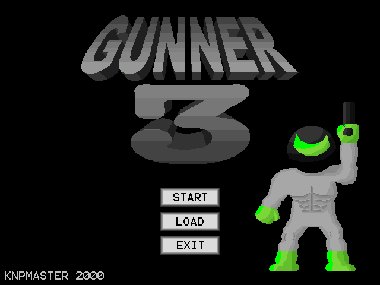
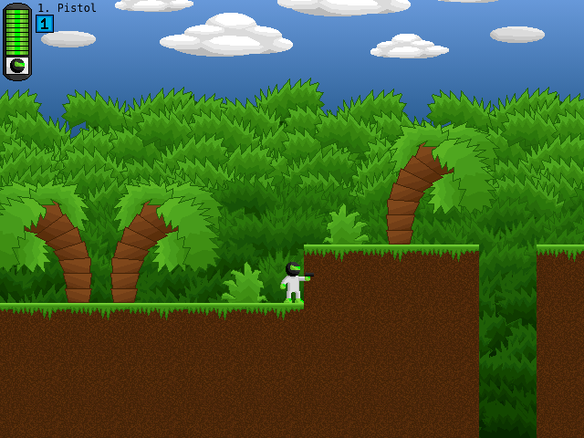

# Gunner 3

A port of **Gunner 3** by KNPMaster (Gary Gasko). The assets, frames and event tables are
extracted from the original Multimedia Fusion 1.5 executable, and the engine that runs them is
reimplemented from reverse engineering, drawing on
[Matt-Esch/anaconda](https://github.com/Matt-Esch/anaconda) and
[NebulaFD](https://github.com/AITYunivers/NebulaFD) among others for what the formats mean.

| Main menu | First level |
|---|---|
|  |  |

**[Play it here](https://androettop.github.io/gunner3/)**, on a keyboard or on a phone. That
demo is built from the latest commit on `main`, the same way a build on your own machine is.

What this is after is the original experience on other platforms, the web first, on
[Excalibur.js](https://excaliburjs.com/), though nothing about the approach is tied to it. The
game is not rewritten as new code: its own event tables are interpreted as they stand, so a port
is a runtime plus the game's data, and the runtime is the only part another platform needs.

That is also why it should play exactly like the original, bugs included: the logic being run
is the game's own. Most of it already does; a few minor details are still being polished, and
two departures are deliberate and listed at the end.

The game itself is not here. `Gunner 3` is its author's; a build reads a copy of the original,
fetched or already yours, and nothing in this repository carries it. It is freeware, and still
where it has always been: on its author's site, [thegamespage.com](https://www.thegamespage.com/),
and on the [Internet Archive](https://archive.org/details/gunner3).

## Licence

The code (the runtime, the unpacker and the tooling) is **GPLv3**, in `LICENSE`. The game's
own data is not covered by it.

## What is in here

| Path | Contents |
|---|---|
| `web/` | The runtime, as a library: one precompiled ES module that plays a package |
| `tools/unpack/` | Reads a Clickteam game and writes the package the runtime loads |
| `tools/*.sh` | Fetching a copy of the game and a soundfont, and building a page out of them |
| `docs/` | Notes on the file formats reverse-engineered along the way |

A copy of the game and the soundfont its music is played with land in `game/`, and builds in
`build/`; git ignores both.

## Building

```sh
./tools/package.sh          # or: ./tools/package.sh gunner3.exe build
npx --yes serve build
```

Without a path it fetches one: `tools/fetch-game.sh` takes a copy from the Internet Archive over
a pinned checksum, into `game/`. A copy already there is left alone. `tools/fetch-soundfont.sh`
does the same for [GeneralUser GS](https://www.schristiancollins.com/generaluser.php), which is
the instrument bank the music is played with; `$SOUNDFONT` points at one you already have.

That takes about five seconds and writes three things: `fusion-runtime.js`, a `game.zip` holding
everything the runtime needs, and an `index.html` that imports the one and calls it with the
other:

```html
<canvas id="game"></canvas>
<script type="module">
  import { play } from './fusion-runtime.js';
  window.fusion = await play({ package: 'game.zip', canvas: 'game' });
</script>
```

That is the whole of the page, and the whole of the library's public surface. A build comes to
6.0 MB: 5.1 MB of game, of which 3.0 MB is the instruments its music needs, and 1.0 MB of
runtime.

The input can be either the installer the game's own page hands you or the game inside it, and
which it is does not have to be said. `tools/unpack` reads the executable and writes the
package: the chunks, the compression, the image bank, the sounds, the music, the frames, the
objects and the event tables. The music is MIDI, a score with no instruments in it, so the
packaging step also cuts a General MIDI bank down to the presets the game's fifteen tracks
reach (53 of 287, and 272 samples of 920) and puts that in the package too. `web/` is the
runtime that interprets it.

The page is the canvas and nothing else, on black. The loading screen is drawn on that canvas by
the runtime, and names the game as its package gives it.

`./tools/package.sh --single-file` writes one HTML file instead, library and package inside it
as data URLs, which runs straight off the file system. A page that fetches a package beside it
cannot, because the browser counts that as cross-origin.

`.github/workflows/build.yml` does all of this on every push, caching the download, and
publishes the result to GitHub Pages as the demo above.

### Working on the runtime

```sh
cd web
npm install
npm run pack       # fetches a copy of the game and packs it into public/game.zip, once
npm run dev
```

The dev server's page calls the library exactly as a built one does. Either way the runtime
leaves the running game on `window.fusion`, and with it `fusion.debug`, which is described
below.

`npm run build` produces the library and its type declarations, and checks every opcode in the
game's event tables against what the interpreter implements.

### Looking at it while it runs

A Fusion game is its own event table running over its own objects, and when it does something
unexpected the question is always about that state. `fusion.debug` is the way into it from a
console, and `fusion.debug.help()` lists the whole of it. What it hands back are the runtime's
own objects rather than copies, so writing to one changes the game:

```js
fusion.debug.state();                    // the frame, the tick, the camera, what is playing
fusion.debug.show(3);                    // jump to a frame, by index or by name
fusion.debug.instances('Gunner');        // what is in the frame, as a table
fusion.debug.set('Health', 0, 100);      // write an alterable value; a counter's is clamped
fusion.debug.pause(); fusion.debug.step(1);          // hold the game, then hand it one tick
fusion.debug.watch('Gunner');                        // report its values as they change
fusion.debug.record(); fusion.debug.fired();         // count what fires, then read the count
fusion.debug.trace(207); fusion.debug.traceLines();  // watch one event decide, condition by condition
fusion.debug.destroyed();                            // what has been taken away, and by which event
```

Held still, the game is still drawn: only its logic stops, so a paused frame can still be looked
at, moved around and asked what it is showing. What is asked for outlives the frame it was asked
of, since what a level does as it opens is exactly what is worth watching: a held game stays
held across a jump, and counting stays on.

The game otherwise stops while its window belongs to somebody else, which is no use at all when
the window being used is the browser's own tools: `fusion.debug.pauseOnBlur(false)` turns that
off, and it is remembered across the reloads such work is made of.

A page that would rather keep its window to itself passes `debug: false` to `play`, or a name of
its own to be reached under.

### Building the unpacker

`tools/unpack` is a Rust program with one dependency, and `tools/package.sh` builds it for you.
On its own:

```sh
cargo run --release --manifest-path tools/unpack/Cargo.toml -- gunner3.exe game.zip
```

It reads the format described in `docs/mmf15-format.md`, which was worked out here and checked
reading by reading against a dump made by an unrelated program: every image, sound, frame,
object, animation, condition, action and parameter field, with no mismatches.

## Playing it with a thumb

On a phone the game comes up with controls over it, fitted to the screen: the left half steers,
and the buttons are the keys the game already reads. A cogwheel in the corner turns them on or
off, along with how the game is fitted, whether it is smoothed as it is scaled, and how loud it
is; what is chosen there is kept for next time.

A layout is data, and `web/src/runtime/touch/layout.ts` holds this game's. Another game is
another list, which `play({ touch: [...] })` takes in place of it.

## The game

`Gunner 3`, Multimedia Fusion 1.5, runtime 768.0 build 6480.

| Content | Count |
|---|---|
| Frames (levels) | 12 |
| Images | 2611 |
| Sounds | 34 |
| Music tracks | 15 |
| Object types | 375 |
| Events | 7722 |

Levels are wide side-scrollers, up to 7500x480 and 6000x2300 pixels.

## How the port works

The port does not hand-translate the game's 7722 events. It interprets the package's event
tables at runtime, which is practical because the whole game uses only 34 condition opcodes and
43 action opcodes, and its expressions are simpler still: 90% are a bare constant and the rest
are `operand operator operand` over ten token kinds.

Fusion's per-tick model is reproduced directly: every event is visited in order, its conditions
narrow a per-event instance selection, and its actions apply to that selection. An unimplemented
condition fails its event rather than letting it fire, so gaps surface as missing behaviour
rather than wrong behaviour.

Collision is per pixel, not per bounding box, as Fusion's is: every backdrop marked an obstacle
is rasterised into a mask for the frame, and two objects meet where the pictures they are
showing have an opaque pixel in the same place. The movement engines are stepped in game ticks
rather than render frames, since Fusion physics is written as per-tick deltas.

### Deliberate deviations

Everything else is meant to match the original, and where it does not yet, that is a detail
still to be polished rather than a decision.

- **The music is played on instruments of its own.** The original read the score note by note
  through whatever synthesiser the machine had, which is why it never sounded the same on two of
  them. Here the runtime carries the synthesiser and the game carries the instruments, so the
  score plays as written, on a good General MIDI set, rather than on the particular one any one
  player happened to hear.
- **Aiming is measured from the muzzle, and rounded.** The reference runtime measures a launch
  toward a position from the shooter's hotspot and truncates the resulting angle. Measured that
  way, this game's six aims come out at 40.5, 1.7 and 178.3 degrees where its own events want
  45, 0 and 180, and truncating sends two of them a whole direction wide of where the gun points.
  From the muzzle, rounded to the nearest direction, all six land where the game puts them.
